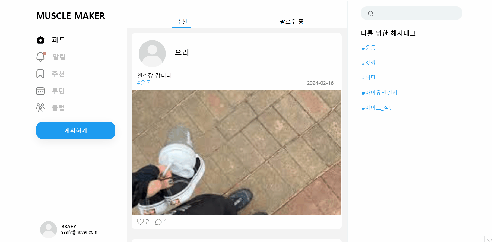
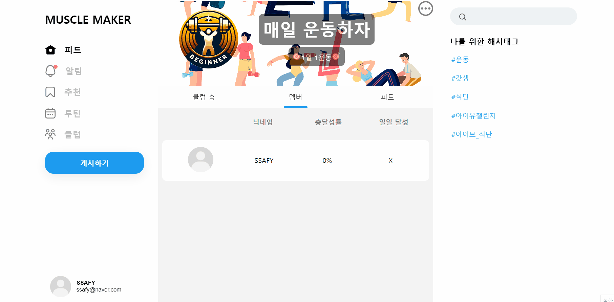
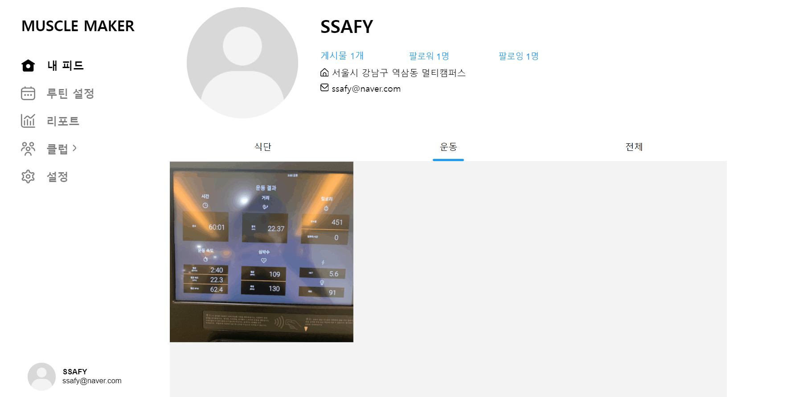
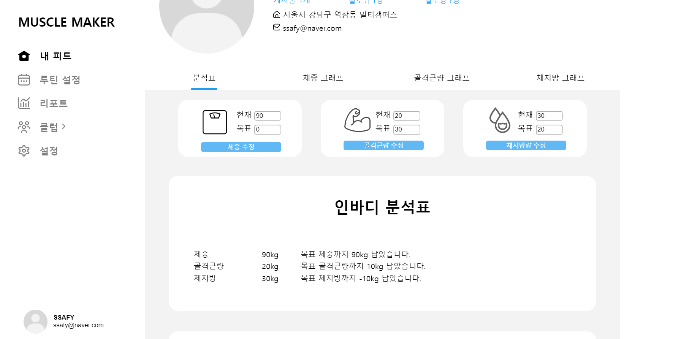
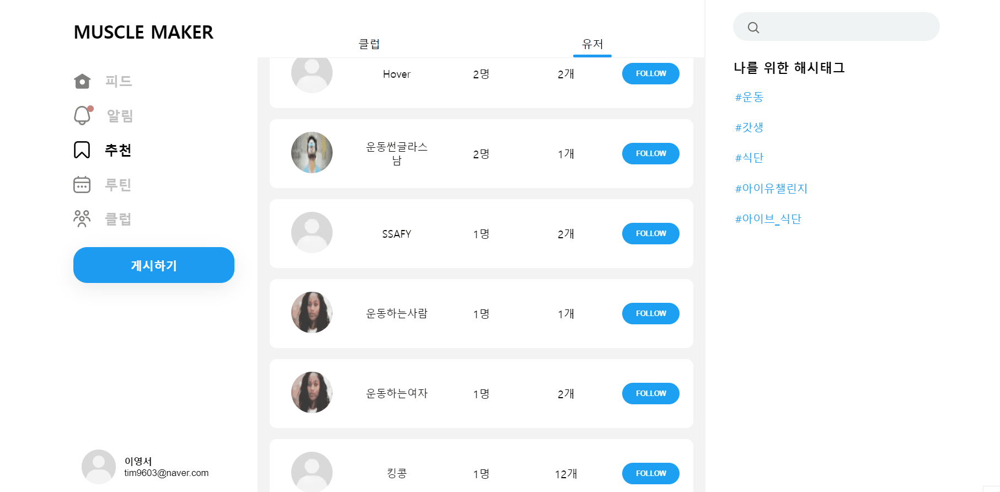
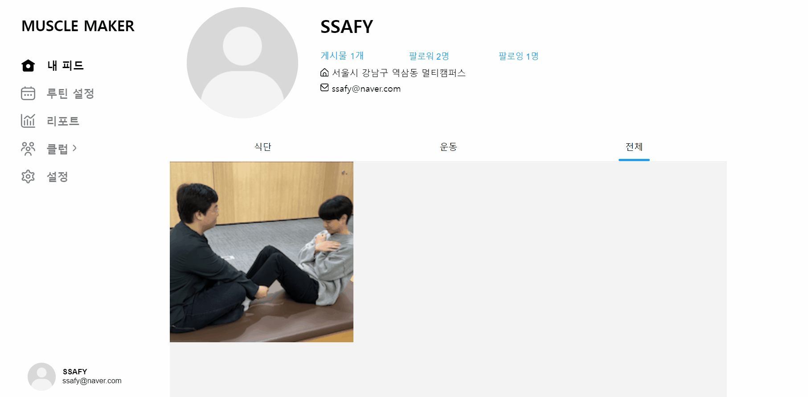
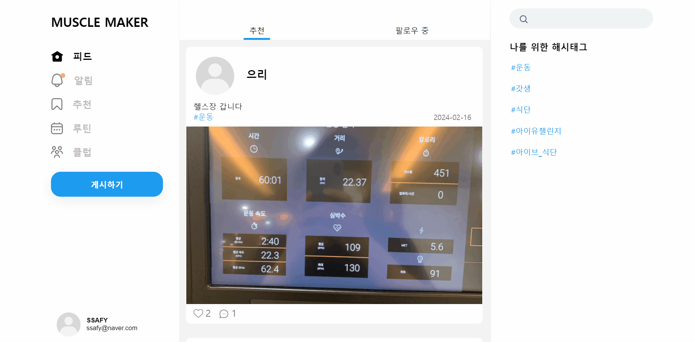

# 📈 Muscle-Maker
> ⚡A109 (서울 1반 9조)
>
> 운동 SNS
>
> 프로젝트 기간 : 2023.12.28 - 2024.02.16 (6주)

 

## :deciduous_tree: 프로젝트 개요

### 프로젝트 기간

-   기획 및 설계 :  2023.12.28 - 2024.01.15
-   프로젝트 개발 : 2024.01.15 - 2024.02.15

### 구성원

-   백엔드 4명
-   프론트엔드 2명

 

## 👍 서비스 소개
- 운동과 식단을 서로 공유하는 운동 SNS 서비스입니다.
- 운동과 식단 피드를 올려 다른 사용자들과 공유할 수 있습니다.
- 운동과 식단 클럽에 참여하여 다른 사람들과 같이 운동/식단을 할 수 있습니다.
- 운동 루틴을 설정 할 수 있고, 다른 사람의 운동 루틴을 보고 가져올 수 있습니다.

 

## 🔨 주요 기술 스택

### ✔️ Frontend

-   `Node`
-   `Next`
-   `React`
-   `TypeScript`

### ✔️ Backend

-   `Java`
-   `Spring Boot`
-   `Spring Security`
-   `Spring Data JPA`
-   `JWT`
-   `Gradle`

### ✔️ DB

-   `MySQL`

### ✔️ Deploy

-   `AWS EC2`
-   `Docker`
-   `Docker-compose`
-   `Nginx`
-   `Jenkins`

### ✔️ Communication

-   형상 관리 - `Gitlab`
-   이슈 및 스크럼 관리 - `Jira`
-   의사소통, 협업 - `Notion`, `Mattermost`
-   디자인 - `Figma`
  
 

## **📚 목차**  

1️⃣ [타겟층](#-타겟층)   
2️⃣ [주요 기능](#-주요-기능)  
3️⃣ [서비스](#-서비스)  
4️⃣ [실행방법](#-실행방법)  
5️⃣ [팀 구성](#-팀-구성)  
6️⃣ [기술 아키텍쳐](#-기술-아키텍쳐)  
7️⃣ [ERD 다이어그램](#-erd-다이어그램)  
8️⃣ [API 명세서](#-api-명세서)   

 

## 😮 타겟층
    ✔ 운동을 하며 동기부여 또는 소속감을 얻고자 하는 운동자들
    ✔ 운동을 하고 싶지만 어떠한 운동을 해야할지 고민하는 사람들
   
 

## 👍 주요 기능
|구분|기능|설명|비고|
|:---|:---|:---|:---|
|1|피드| - 피드 조회 / 등록 / 삭제 할 수 있다.  - 피드 댓글 작성할 수 있다.  - 피드에 좋아요를 할 수 있다.||
|2|추천| - 클럽을 추천 받을 수 있다.   - 유저를 추천 받을 수 있다.|클럽 -> 맴버순, 달성일순, 레벨순  유저 -> 팔로워순, 유사 BMI순, 유사 골격근량순|
|3|루틴| - 일자별 루틴을 설정할 수 있다.  - 다른 사람의 루틴을 조회하고 나의 루틴으로 가져올 수 있다.||
|4|클럽| - 클럽에 가입 및 생성을 할 수 있다.  - 클럽에 피드를 작성할 수 있다.  - 클럽에 작성된 피드를 기준으로 클럽의 성공률, 경험치 성공일 수가 반영된다.||
|5|리포트| - 목표 체중, 골격근량, 체지방량을 설정할 수 있다.  - 주기별로 입력되는 체중, 골격근량, 체지방량을 이용해 시각화 자료를 제공한다.||
|6|팔로우| - 회원간 팔로우/팔로잉 기능을 제공한다.||
|7|알림| - 팔로우/팔로잉, 클럽, 댓글에 이벤트가 발생했을 때 알림을 제공한다.  - 알림을 통해 해당 위치로 바로 이동할 수 있다.|SSE를 활용 하여 구현|
 

# 서비스
## 📌 피드

 - 피드 조회 / 등록 / 삭제 할 수 있다.

 

 - 피드 댓글 작성할 수 있다.
 - 피드에 좋아요를 할 수 있다.

---

## 📌 - 추천

 - 클럽을 추천 받을 수 있다.
 - 유저를 추천 받을 수 있다.

---

## 📌 - 루틴

 - 일자별 루틴을 설정할 수 있다.

 

 - 다른 사람의 루틴을 조회하고 나의 루틴으로 가져올 수 있다.

---

## 📌 - 클럽
 - 클럽에 가입 및 생성을 할 수 있다.
 
 

 - 클럽에 피드를 작성할 수 있고, 피드를 기준으로 클럽의 성공률, 경험치 성공일 수가 반영된다.

 
---

## 📌 - 리포트
 - 목표 체중, 골격근량, 체지방량을 설정할 수 있다.

 
 
 - 주기별로 입력되는 체중, 골격근량, 체지방량을 이용해 시각화 자료를 제공한다.

 

---

## 📌 - 팔로우
 - 회원간 팔로우/팔로잉 기능을 제공한다.

 

 

---

## 📌 - 알림
 - 팔로우/팔로잉, 클럽, 댓글에 이벤트가 발생했을 때 알림을 제공한다.
 - 알림을 통해 해당 위치로 바로 이동할 수 있다.

 

---

 

## 💾 실행방법

### [🔗 포팅 메뉴얼 바로가기]()
- exec 폴더 내 포팅 메뉴얼 참조

 

## 👬 팀 구성
<table>
  <tbody>
    <tr>
     <td align="center">
        <a href="https://github.com/JongJae2">
            
             
            <b>이종재</b>
        </a>
         
        
BE,FE

      </td>
       
      <td align="center">
        <a href="https://github.com/youngseo9603">
            
             
            <b>이영서</b>
        </a>
         
        
Be

      </td>
       
      <td align="center">
        <a href="https://github.com/zsa332">
            
             
            <b>서성원</b>
        </a>
         
        
Infra, BE

      </td>
    </tr>
    <tr>
      <td align="center">
        <a href="https://github.com/dforce103">
          
           
          <b>송찬의</b>
          </a>
           
          
FE

      </td>
      <td align="center">
        <a href="https://github.com/soyeonjwa">
            
             
            <b>좌소연</b>
        </a>
         
        
FE, BE

      </td>
      <td align="center">
        <a href="https://github.com/hello1334">
            
             
            <b>전건휘</b>
        </a>
         
        
FE

      </td>
    </tr>
  </tbody>
</table>

 

## ⚙ 기술 아키텍쳐

 

## 💎 [ERD 다이어그램](https://www.erdcloud.com/d/5HtrrcsSCibroHX3k)

 

## 📘 [API 명세서](https://zesty-pheasant-3d2.notion.site/c72286b8426f46518d5b3f5d2484141e?v=7127dced354b4a31ba0433b9f466b599&pvs=4)

 

## 🍏[와이어프레임](https://www.figma.com/file/WCNg4xM6SWFmTKnQ8uZ3sB/Miracle-Maker?type=design&mode=design)

